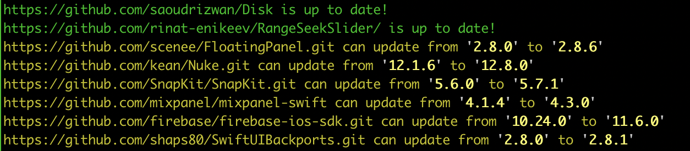

# SPM Version Status

A command line utility to check the latest versions available for the SPM packages declared as depedency in your Xcode Project or SPM package.

Initial idea and reference taken from: https://github.com/gorillatech/spm-check-updates

## Installation

The preferred way, via homebrew:
```bash
brew install fespinoza/repo/spm-version-status
```

Or from source code, compile the script
```bash
swift build --configuration release
sudo cp -f .build/release/SPMVersionStatus /usr/local/bin/spm-version-status
```

## Usage

### Dependency status

To check the status of SPM dependencies of a Xcode project or a SPM package, run:

```bash
spm-version-status
```

By default this will only check the dependencies declared in your Xcode Project or SPM package, not the transitive dependencies, to see the status of everything you can run

```
spm-version-status version-status --mode all
```

which will give an output like



### Dependency changelogs

To get the changelogs, this script internally uses the [github command line utility](https://cli.github.com), gh.
So make sure you install that first.

After that you can run the command

```bash
spm-version-status changelog
```

Where you will get asked which dependency to check the changelog of, like:

```bash
Checking SampleProject.xcodeproj
0: FloatingPanel
1: Nuke
2: SnapKit
3: mixpanel-swift
4: firebase-ios-sdk
5: SwiftUIBackports

Number package to get the changelog of: 2
```

Which will print the changelog of versions **after** the pinned version to the dependenc up to the latest version.

```bash
Changelog for https://github.com/SnapKit/SnapKit.git from 5.6.0 to 5.7.1

# Output in here...
```

If you just want to list the versions released since the last used version in your dependencies use

```
spm-version-status changelog --list
```

## Development

```bash
swift run SPMVersionStatus
```
